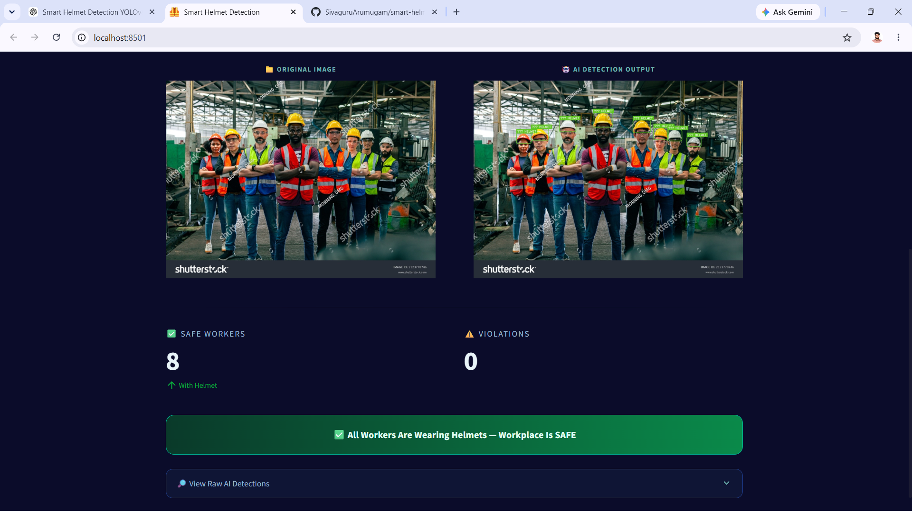
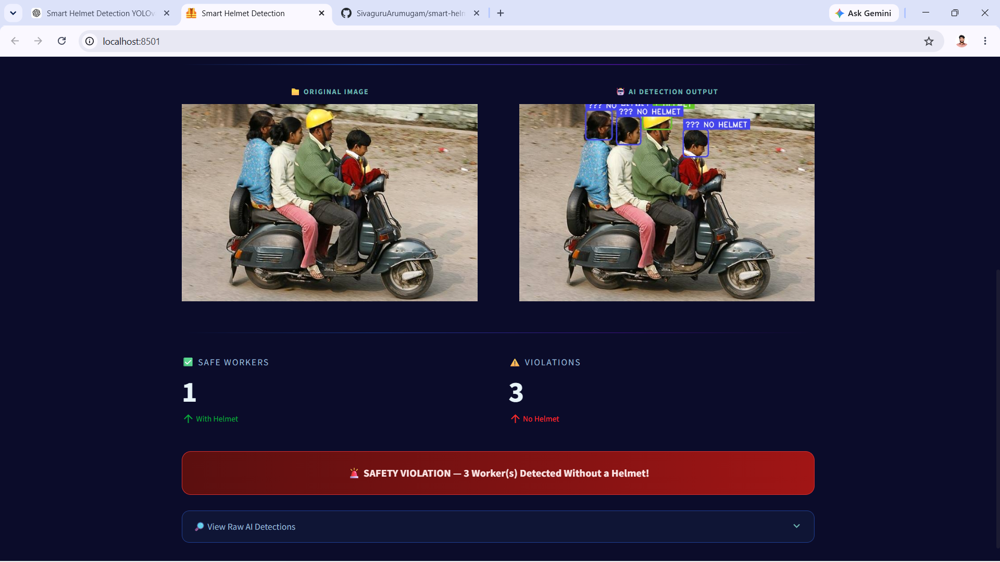

# 🦺 Smart Helmet Detection System Using YOLOv8

<div align="center">


### Real-Time Safety Compliance Monitoring Using Computer Vision & Deep Learning

</div>

---

# 📖 Overview

The Smart Helmet Detection System is an AI-powered workplace safety monitoring solution that automatically detects whether workers are wearing safety helmets in real-time.

Using **YOLOv8**, **OpenCV**, and **Python**, the system analyzes live video streams from webcams, CCTV cameras, or recorded videos to identify workers and safety helmets. If a worker is detected without a helmet, the system highlights the violation and can trigger alerts or logging mechanisms.

This project aims to improve workplace safety, reduce manual supervision, and ensure compliance with industrial safety regulations.

---

# 🎯 Problem Statement

In industries such as construction, manufacturing, mining, and transportation, helmet usage is mandatory for worker safety. Traditional monitoring methods rely heavily on human supervisors, making the process:

- Time-consuming
- Error-prone
- Difficult to scale
- Inefficient for large environments

This project automates helmet compliance monitoring using Artificial Intelligence and Computer Vision.

---

# 🚀 Key Features

✅ Real-Time Helmet Detection

✅ Person Detection

✅ Multi-Person Monitoring

✅ Helmet Compliance Verification

✅ Violation Detection

✅ Live Webcam Support

✅ CCTV Video Processing

✅ High-Speed YOLOv8 Inference

✅ Offline Processing

✅ Easy Deployment

---

# 🏗️ System Architecture

```text
Camera / CCTV Feed
         │
         ▼
 Video Capture (OpenCV)
         │
         ▼
 Frame Preprocessing
         │
         ▼
      YOLOv8
         │
 ┌───────┴────────┐
 ▼                ▼
Person         Helmet
Detection      Detection
 └───────┬────────┘
         ▼
 Compliance Logic
         │
 ┌───────┴────────┐
 ▼                ▼
Helmet        No Helmet
Detected      Detected
   │               │
   ▼               ▼
 Safe         Violation Alert
 Worker
```

---

# 🛠️ Technology Stack

| Technology | Purpose |
|------------|----------|
| Python | Programming Language |
| YOLOv8 | Object Detection |
| OpenCV | Real-Time Video Processing |
| NumPy | Numerical Operations |
| Roboflow | Dataset Management |
| LabelImg | Data Annotation |
| Git & GitHub | Version Control |

---

# 📂 Project Structure

```text
Smart-Helmet-Detection/

├── dataset/
│   ├── images/
│   └── labels/
│
├── models/
│   └── best.pt
│
├── screenshots/
│   ├── output1.png
│   ├── output2.png
│   └── output3.png
│
├── detect.py
├── requirements.txt
├── README.md
└── output/
```

---

# 📊 Dataset

The model was trained on a helmet detection dataset containing:

| Class ID | Class Name |
|-----------|------------|
| 0 | Helmet |
| 1 | Person |

Dataset images were annotated using LabelImg/Roboflow and converted into YOLO format.

---

# ⚙️ Installation

### Clone Repository

```bash
git clone https://github.com/yourusername/smart-helmet-detection-yolov8.git
```

### Navigate to Project Folder

```bash
cd smart-helmet-detection-yolov8
```

### Install Dependencies

```bash
pip install -r requirements.txt
```

---

# ▶️ Run the Application

```bash
python detect.py
```

For webcam:

```python
cap = cv2.VideoCapture(0)
```

For CCTV/IP Camera:

```python
cap = cv2.VideoCapture("camera_url")
```

---

# 📸 Project Output Screenshots

## 🟢 Helmet Detected

Worker correctly wearing a safety helmet.



---

## 🔴 No Helmet Detected

Worker identified without a helmet.



---

## 👷 Multiple Workers Detection

Simultaneous monitoring of multiple workers.


---

# 🔍 Working Process

### Step 1

Capture live video feed from webcam or CCTV.

### Step 2

Preprocess incoming video frames.

### Step 3

Perform object detection using YOLOv8.

### Step 4

Detect:

- Person
- Helmet

### Step 5

Verify helmet compliance.

### Step 6

Mark:

- Safe Worker → Green Bounding Box
- Violation → Red Bounding Box

### Step 7

Display output in real-time.

---

# 📈 Performance Metrics

| Metric | Result |
|----------|----------|
| Precision | 92.7% |
| Recall | 89.4% |
| F1 Score | 91.0% |
| mAP@50 | 89.8% |
| FPS | 20–25 FPS |

---

# 🎯 Applications

- Construction Site Monitoring
- Manufacturing Industries
- Mining Operations
- Industrial Safety Surveillance
- Smart Factory Systems
- Workplace Compliance Monitoring

---

# 🔮 Future Enhancements

- Face Recognition Integration
- Employee Identification
- Helmet Color Classification
- Multi-Camera Monitoring
- Email & SMS Alerts
- Dashboard Analytics
- Cloud Deployment
- IoT Integration

---

# 🏆 Results

The developed Smart Helmet Detection System successfully:

- Detects workers and helmets in real-time.
- Identifies safety violations accurately.
- Supports multiple workers simultaneously.
- Operates efficiently on standard hardware.
- Enhances workplace safety through automation.

---

# 👨‍💻 Author

## Sivaguru A

**Data Scientist | Machine Learning Engineer | AI Developer**

📧 Email: sivaguru.a3011@gmail.com

🔗 LinkedIn: Add Your LinkedIn Profile

💻 GitHub: Add Your GitHub Profile

---

# ⭐ Support

If you found this project useful, please consider giving this repository a ⭐ on GitHub.

---

# 📜 License

This project is intended for educational, research, and workplace safety monitoring purposes.

© 2026 Sivaguru A. All Rights Reserved.
